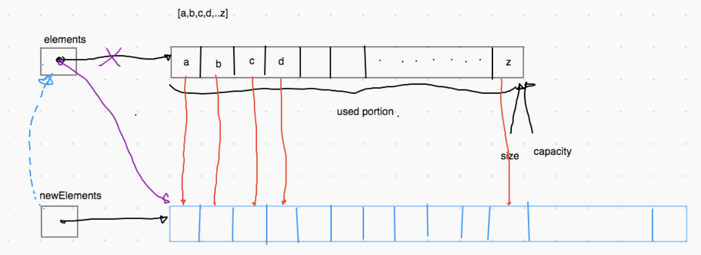
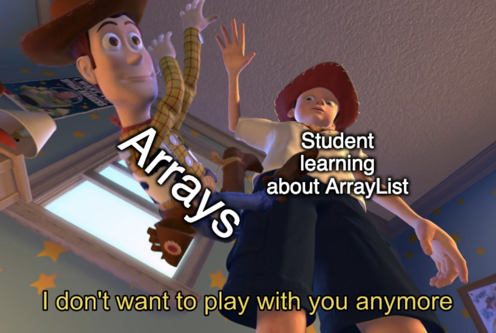

# Exercise 8.4 - 🗃️ Array List

## 🎯 Objectives

- **Implement** an array list data structure in Java.

## 🔨 Setup

1. Clone the repo (or download the zip) for this exercise, which you can find [here](https://github.com/JAC-CS-Programming-4-W23/E8.2-Array-List).
2. Start IntelliJ, go to `File -> Open...`, and select the cloned/downloaded folder.
3. If at the top it says "Project JDK is not defined", click "Setup JDK" on the top right, and select the JDK version you have installed on your machine.

   

4. To get the unit tests to work, open `TestArrayList.java` and add JUnit to the classpath:

   

   - Just click "OK" on the resulting dialogue window and all the test-related red squigglies should disappear.

## 🔍 Context

Now that we've learned about `LinkedList`, let's go back to our friend the `ArrayList`. This is most likely the list data structure you're used to using in C#. An **array list** is a data structure whose data lives in a collection represented by contiguous blocks of memory, also known as an _array_.


Not an array in site! This is not to say that arrays are bad, it's simply another way to think of data structures.

To implement the list API in a comparable way to the LinkedList we should not run out of cells to put data, i.e.: there is no "capacity". Unless we do something, we will eventually run out of space in our array:



The major question is: _**How do we determine the size of the new array?**_

## 🚦 Let's Go

One of the first thing you'll see when you open `ArrayList.java` are these fields:

```java
private int moveElementCounter;
private int expandCounter;
private int expandMoveElementCounter;
```

We want to use these to keep some statistics about our `ArrayList` implementation. The statistics being:

- Calls to expand
- Available cells
- Element moves when adding
- Element moves when expanding

Here's the method we'll use when expanding. It's your job to play around with different capacity values and observe what the last test in the suite reports.

```java
private void checkCapacityAndExpand() {
    if (size < elements.length) {
        return;
    }

    int newCapacity = ...; // TODO
    T[] newArray = (T[]) new Object[newCapacity];

    for (int i = 0; i < size; i++) {}
        newArray[i] = elements[i];
    }

    elements = newArray;
}
```

- Inside of the `ArrayList` class, implement the `List` interface which in turn should implement the `Traversable` interface.
- Pass the unit tests in `TestArrayList`.
- `shift()` and `unshift()` have been given to you to start implementing the other methods.

## 🔬 Observations

- What do you think the performance differences might be with using different capacity sizes for the new array?
- When do you think it could be advantageous to use an array list over a linked list?

---


